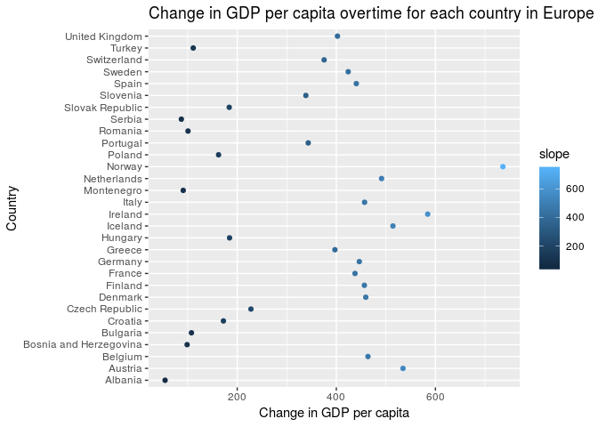

Homework6-Exercises
================
Curtis Fox

-   [Writing Functions](#writing-functions)
-   [Working with a Nested Data Frame](#working-with-a-nested-data-frame)

``` r
options(warn = -1) # supresses warnings
suppressPackageStartupMessages(library(gapminder))
suppressPackageStartupMessages(library(tidyverse))
```

    ## Note: the specification for S3 class "difftime" in package 'lubridate' seems equivalent to one from package 'hms': not turning on duplicate class definitions for this class.

``` r
suppressPackageStartupMessages(library(broom))
```

``` r
library(gapminder)
library(tidyverse)
library(broom)
```

Writing Functions
-----------------

I'm choosing to do the second option, which is to write some experimental functions. I'm interested in numerical programming, and so I will write a function that performs gradient descent, and a function that performs Newton's method. Both gradient descent and Newton's method are numerical methods to find the minimum of a function, and are often used when finding a minimum of a function is non-trivial. Note that both these methods have certain mathematical restrictions that must hold in order to be justified in being used. However, we won't worry about these here and stick with simple examples.

I first write the function to perform gradient descent:

``` r
# the input parameters are a function f, its derivative df, its second derivative df2, a starting value x0, an accuracy parameter eps, the max number of iterations the while loop can run for maxIter, and a starting stepsize s
gradientDescent = function(f, df, x0, eps, maxIter, s) { 
  i = 0
  x <- x0
  fval <- f(x0)
  dfval <- df(x0)
  while(i < maxIter & dfval > eps){
    x <- x - s * dfval # this step actually performs the descent, to search for the minimization point
    fval <- f(x)
    dfval <- df(x)
    i <- i + 1
  }
  print("x coordinate of minimization point, for gradient descent")
  print(x) # prints the solution, which is the x value of the point that minimizes the function
  print("value of function f at x")
  print(fval) # prints the function value at x
}
```

Now I write a function to perform Newton's method:

``` r
# the input parameters are a function f, its derivative df, its second derivative df2, a starting value x0, an accuracy parameter eps, the max number of iterations the while loop can run for maxIter, and a starting stepsize s
NewtonMethod = function(f, df, df2, x0, eps, maxIter, s) {
  i = 0
  x <- x0
  fval <- f(x0)
  dfval <- df(x0)
  df2val <- df2(x0) # note we need to compute the second derivative for this method
  while(i < maxIter & dfval > eps){
    x <- x - dfval / df2val # note the different descent step compared to gradient descent
    fval <- f(x)
    dfval <- df(x)
    df2val <- df2(x)
    i <- i + 1
  }
  print("x coordinate of minimization point, for Newton's method")
  print(x) # prints the solution, which is the x value of the point that minimizes the function
  print("value of function f at x")
  print(fval) # prints the function value at x
}
```

Note that in general, Newton's method takes fewer iterations of the while loop to find a solution, compared to gradient descent.

I then write an example funcation to pass to gradient descent, in this case the quadratic function x^2.

``` r
f <- function(x) {
  return(x^2)
}
```

I then write a function for the derivative of x^2, which is 2x. The derivative is required for gradient descent method and Newton's method.

``` r
df <- function(x) {
  return(2*x)
}
```

Lastly I write a function for the second derivative of x^2, which is 2. The second derivative is required for Newton's method.

``` r
df2 <- function(x) {
  return(2)
}
```

Note that I wrote functions for the function f, as well as its first and second derivatives. This allows for more robustness, as someone could go in and change these functions withut actually making changes to the gradient descent or newton's method functions.

Now lets actually run gradient descent and Newton's method using our example functions. Note that since these are numerical methods, the solution they give may only be an approximation of the actual solution.

``` r
gradientDescent(f, df, 3, 1e-8, 1000, 0.01)
```

    ## [1] "x coordinate of minimization point, for gradient descent"
    ## [1] 5.048902e-09
    ## [1] "value of function f at x"
    ## [1] 2.549141e-17

``` r
NewtonMethod(f, df, df2, 3, 1e-8, 1000, 0.01)
```

    ## [1] "x coordinate of minimization point, for Newton's method"
    ## [1] 0
    ## [1] "value of function f at x"
    ## [1] 0

Working with a Nested Data Frame
--------------------------------

I will use the gapminder prompt to develop this, and the split-apply-combine link provided, given [here](http://stat545.com/block024_group-nest-split-map.html) as well.

We first group by country and continent, and create a nested data frame for each group, such that we now have a row for each country.

``` r
nestData <- gapminder %>%
  group_by(country, continent) %>%
  nest() 
```

We now apply a map function to each nested data frame, fitting a linear regression model to each nested frame. We model GDP per capita versus year for each country.

``` r
fittedData <- nestData %>%
  mutate(fit = map(data, ~ lm(gdpPercap ~ I(year - 1950), data = .)))  
```

Now tidy up the data with the tidy function, allowing us to more easily view the results of the regression models, and only select the variables we intend to explore.

``` r
cleanData <- fittedData %>%
  mutate(clean = map(fit, tidy)) %>%
  select(continent, country, clean)
```

Now finally unnest the data frames, and reformat/rename things to create a cleaner data table with unnecessary data removed.

``` r
finalData <- cleanData %>%
  unnest(clean) %>%
  mutate(term = recode(term, `(Intercept)` = 'intercept', `I(year - 1950)` = 'slope')) %>%
  select(continent, country, term, estimate)  %>%
  spread(key = term, value = estimate) 
```

We now create a scatterplot and a table showing the data retrieved, selecting only rows with continent equal to Europe. We select only rows for Europe to avoid having the plot become to cluttered.

``` r
europeOnly <-finalData %>%
  filter(continent == 'Europe') 

knitr :: kable(europeOnly) # print table
```

| continent | country                |   intercept|      slope|
|:----------|:-----------------------|-----------:|----------:|
| Europe    | Albania                |   1648.8580|   54.45792|
| Europe    | Austria                |   4642.0331|  534.57231|
| Europe    | Belgium                |   6216.7289|  463.86539|
| Europe    | Bosnia and Herzegovina |    567.4949|   98.89099|
| Europe    | Bulgaria               |   3207.6680|  107.67414|
| Europe    | Croatia                |   4252.2524|  172.18508|
| Europe    | Czech Republic         |   7202.2611|  227.72035|
| Europe    | Denmark                |   8119.1980|  459.41108|
| Europe    | Finland                |   4004.6552|  456.57856|
| Europe    | France                 |   5921.3469|  437.70249|
| Europe    | Germany                |   7388.7178|  446.37175|
| Europe    | Greece                 |   2251.9241|  397.19026|
| Europe    | Hungary                |   5443.2959|  184.57220|
| Europe    | Iceland                |   5360.4583|  514.26997|
| Europe    | Ireland                |  -1480.6764|  584.38246|
| Europe    | Italy                  |   2762.5096|  457.04066|
| Europe    | Montenegro             |   4521.6595|   91.06458|
| Europe    | Netherlands            |   7255.8395|  491.28857|
| Europe    | Norway                 |   5030.5045|  736.16278|
| Europe    | Poland                 |   3626.3356|  162.38028|
| Europe    | Portugal               |   1227.6609|  343.26885|
| Europe    | Romania                |   4329.4899|  100.70102|
| Europe    | Serbia                 |   6729.7368|   87.29873|
| Europe    | Slovak Republic        |   4989.8264|  183.92218|
| Europe    | Slovenia               |   4087.9520|  338.52983|
| Europe    | Spain                  |   1040.1465|  440.32813|
| Europe    | Sweden                 |   7436.2864|  423.96067|
| Europe    | Switzerland            |  16001.1277|  375.36294|
| Europe    | Turkey                 |   1187.6904|  111.24620|
| Europe    | United Kingdom         |   7511.7968|  402.32801|

``` r
europeOnly %>%
  ggplot(aes(slope, country, colour = slope)) +
    geom_point() + 
    ggtitle("Change in GDP per capita overtime for each country in Europe") +
    xlab("Change in GDP per capita") + 
    ylab("Country")
```



As can be seen from the plot, Norway seems to have the largest change iover time. Albania seems to have the smallest increase in GDP per capita over time.
